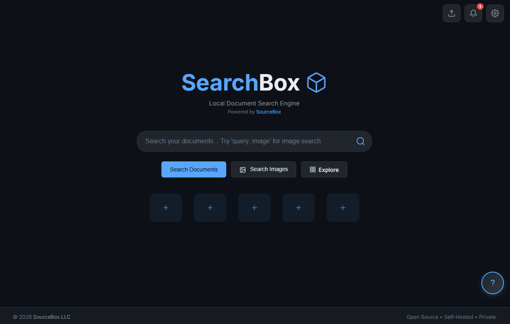
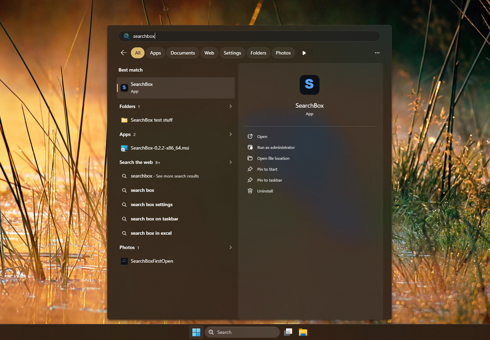

# SearchBox

**Find anything on your computer — instantly, and completely private.**

SearchBox looks *inside* your files — PDFs, Word documents, spreadsheets,
notes, web pages, even images — and finds what you're after in a blink, even
if you don't remember the exact words (or spell them wrong). Everything runs
on your own computer. Nothing is uploaded, tracked, or sent anywhere.

Free, open source, and yours to keep.

<p align="center">
  
</p>

---

## What you can do with it

| | |
|---|---|
| 🔎 **Search everything** | Type a word or phrase; SearchBox searches the *contents* of your files, not just their names. |
| ✨ **Forgiving search** | Typos are fine — it still finds what you meant. |
| 📂 **Point it at a folder** | Pick any folder and SearchBox reads everything inside so it's all searchable. |
| 🗂️ **Open files in the app** | Read PDFs, Word docs, and notes right inside SearchBox. |
| 🖼️ **Browse your images** | A built-in gallery and an "Explore" view to flip through everything visually. |
| 🔒 **Private vault** | Upload sensitive files and lock them behind your password — encrypted on disk. |
| 🤖 **AI summaries** *(optional)* | Connect a free local AI and get a short summary of your results — still 100% on your machine. |
| ⭐ **Bookmarks & history** | Pin your most-used documents and jump back to recent searches. |

---

## Get SearchBox (Windows)

The easy way — no setup, no technical steps:

1. Open the [**Releases** page](https://github.com/SourceBox-LLC/SearchBox/releases).
2. Download the latest **`SearchBox-…-x86_64.msi`**.
3. Double-click it and follow the installer.
   *(Windows may show a "publisher not recognized" notice the first time — click **More info → Run anyway**.)*
4. Launch **SearchBox** from the Start menu.

SearchBox opens in its own window, just like any normal app. **Close the
window to quit; reopen it from the Start menu whenever you like.**

<p align="center">
  
</p>

Runs on **Windows 10 and 11**. *(On Windows 10 you may be asked once to
install Microsoft's free "WebView2" component — it's a quick automatic
download. Windows 11 already has it.)*

---

## Your first two minutes

1. **Create your account.** The first time you open SearchBox it asks you to
   set up an account — just an email and a password. This never leaves your
   computer; it's how you log in and how your private vault is locked.
2. **Add a folder.** Go to **Settings**, choose a folder to index (your
   *Documents* folder is a great start), and watch the progress as SearchBox
   reads through it.
3. **Search.** Start typing in the search bar. Results appear as you go —
   click one to open it.

That's it. You can add more folders any time.

> 📷 _Screenshot: search results for an example query._

---

## Search shortcuts

Type these right in the search bar to narrow your results:

- `budget ::pdf` — only **PDF** files
- `notes ::docx` — only **Word** documents
- `figures ::xlsx` — only **Excel** spreadsheets
- `vacation ::image` — jump to the **image** gallery
- `taxes ::vault` — only files in your **private vault**

Power users can also combine filters with `::&&` (and), `::||` (or), and
`::!` (not).

---

## Your privacy, in plain terms

- **Nothing leaves your computer.** No ads, no tracking, no cloud account, no
  phoning home.
- **Your vault is encrypted** with your password using strong encryption
  (AES-256). Files in the vault can't be read without it.
- **Recovery key for password reset.** During setup, you'll download a recovery
  key — save it somewhere safe. If you forget your password, the recovery key
  lets you reset it and keep accessing your vault. Without the recovery key,
  vault files **cannot** be recovered.

Curious about the details? See [SECURITY.md](SECURITY.md) for encryption details and recovery key guidance.

---

## Questions people ask

**Is it really free?**
Yes — free and open source (AGPL-3.0 license).

**Do I need an internet connection?**
No. SearchBox works entirely offline. (The only exception is the optional AI
feature, and even that runs locally once it's set up.)

**Where are my files and data stored?**
Your search index and settings live in `%LocalAppData%\SearchBox` on your PC.
Uninstalling SearchBox leaves your data right where it is.

**It says the "search engine" is off — what do I do?**
SearchBox includes a small search engine that normally starts on its own. If
it doesn't, open **Settings → Search Engine → Start**. (With the official
installer this is handled for you automatically.)

**How do I turn on AI summaries?**
Install [Ollama](https://ollama.com) (a free tool that runs AI models on your
own machine), then enable it in **Settings**. Everything stays local.

**Can it search my downloads?**
If you use qBittorrent, SearchBox can find and index your completed downloads
— switch it on in **Settings**.

---

## Other ways to run it

<details>
<summary><strong>Docker (Linux, macOS, Windows)</strong></summary>

```bash
docker compose up -d
# App:          http://localhost:8080
# Search engine: http://localhost:7700
```

First launch walks you through account setup, then index a folder from the
Settings page. Data lives in named volumes (`searchbox-data`,
`searchbox-vault`, `searchbox-thumbnails`, `meili-data`), so `docker compose
down` won't delete anything.

One-shot run without compose:

```bash
docker run -d --name searchbox \
  -p 8080:8080 -p 7700:7700 \
  -v searchbox-data:/app/instance \
  -v searchbox-vault:/app/vault \
  -v searchbox-thumbnails:/app/static/thumbnails \
  -v meili-data:/app/meili_data \
  -e SEARCHBOX_SECRET_KEY=change-me \
  sourcebox/searchbox:latest
```

On Windows, to index drive letters (`C:\`, `D:\`, …) rather than whatever
Docker maps into its Linux VM, add the drive-letter overlay:

```bash
docker compose -f docker-compose.yml -f docker-compose.windows.yml up -d
```

</details>

---

## For developers

<details>
<summary><strong>Tech stack</strong></summary>

- **[Axum](https://github.com/tokio-rs/axum)** web server (Rust / Tokio)
- **[SQLite](https://www.sqlite.org/)** via `sqlx` — single-file database
- **[Meilisearch](https://www.meilisearch.com/)** sidecar — typo-tolerant full-text search
- **[MiniJinja](https://github.com/mitsuhiko/minijinja)** HTML templates
- **[wry](https://github.com/tauri-apps/wry)** + **[tao](https://github.com/tauri-apps/tao)** — the native desktop window (WebView2) on Windows
- **[Ollama](https://ollama.com/)** *(optional)* — local LLMs for AI summaries
- **Pure-Rust document extraction** — `pdf-extract`, `calamine` (XLSX), `quick-xml` + `zip` (DOCX), `pulldown-cmark`, `scraper` (HTML)
- **AES-256-GCM vault** with a PBKDF2-derived key (600k rounds) from the admin password
- **Single self-contained binary** — templates and static assets are embedded via `rust-embed` (debug builds read from disk so edits are live)

</details>

<details>
<summary><strong>Build &amp; run from source</strong></summary>

Requires Rust 1.84+ and a Meilisearch binary (download one from
[meilisearch releases](https://github.com/meilisearch/meilisearch/releases)
and drop `meilisearch(.exe)` next to the built `searchbox` binary — it's
auto-detected — or set its path in **Settings → Search Engine**).

```bash
cargo run --release
# Windows opens the SearchBox desktop window; elsewhere browse to
# http://localhost:8080 — first run walks you through account setup
```

See [`BUILD.md`](BUILD.md) for release builds and the Windows installer (MSI).

</details>

<details>
<summary><strong>Configuration (environment variables)</strong></summary>

| Var | Default | Purpose |
|---|---|---|
| `SEARCHBOX_HOST` | `0.0.0.0` | Bind address |
| `SEARCHBOX_PORT` | `8080` | Bind port |
| `SEARCHBOX_DB_DIR` | `.` | Where `searchbox.db` lives |
| `SEARCHBOX_BASE_DIR` | cwd | Root for writable runtime dirs (`vault/`, `meili_data/`, `static/thumbnails/`) |
| `SEARCHBOX_SECRET_KEY` | dev stub | Session cookie signing (set this in production) |
| `MEILI_PUBLIC_HOST` | — | Browser-facing Meilisearch URL when it differs from the server-side one (e.g. a Docker bridge) |
| `MEILI_PORT` | `7700` | Port for the Meilisearch sidecar |
| `MEILI_MASTER_KEY` | dev stub | Meilisearch master key |
| `OLLAMA_URL` | — | Set via the Settings page at runtime; this env var is only read by tooling |

Everything else — Meilisearch path, Ollama URL / model / timeout, qBittorrent
credentials, AI-search toggle — lives in the `settings` table and is editable
from the Settings page.

</details>

<details>
<summary><strong>Project layout</strong></summary>

```
├── src/           # Rust source
│   ├── main.rs    # boot, desktop window (wry), graceful shutdown
│   ├── config.rs, db.rs, state.rs, error.rs, templates.rs
│   ├── auth/      # argon2 + session extractor
│   ├── models/    # SQLx structs + CRUD
│   ├── routes/    # Axum route handlers
│   ├── services/  # Meilisearch, Ollama, extractor, Meili supervisor
│   ├── vault/     # AES-256-GCM + PBKDF2 wrap/unwrap
│   └── jobs/      # background indexing-job tracker
├── schema.sql     # applied on boot
├── templates/     # HTML (MiniJinja)
├── static/        # CSS + JS
├── wix/           # Windows MSI installer
├── Dockerfile, docker-compose.yml, fly.toml, entrypoint.sh
```

**Not yet supported:** indexing offline Wikipedia (ZIM) archives — the
endpoints return `501` pending a Rust libzim binding.

</details>

---

## License

[AGPL-3.0-or-later](LICENSE) · © SourceBox LLC
